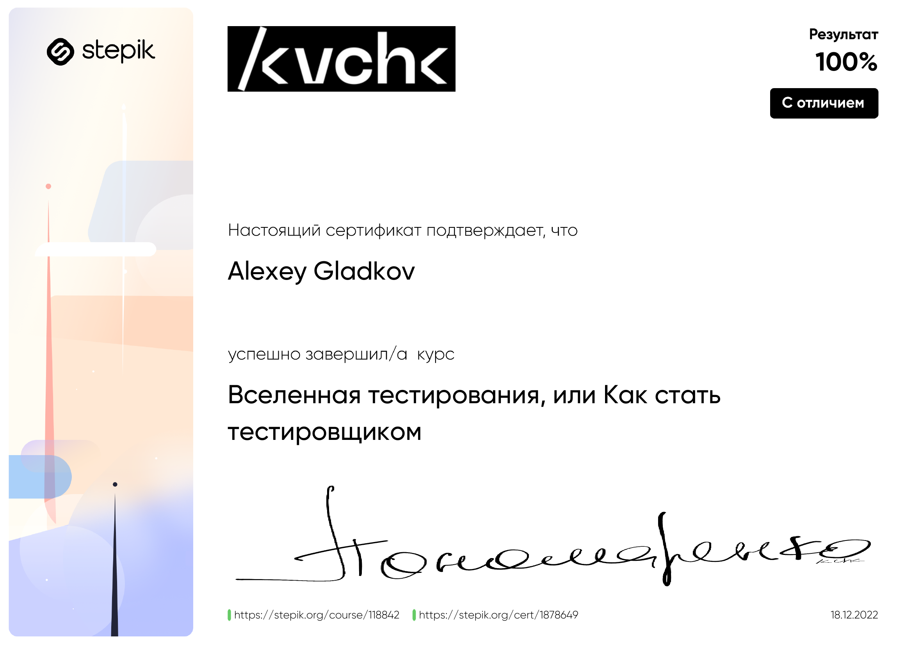
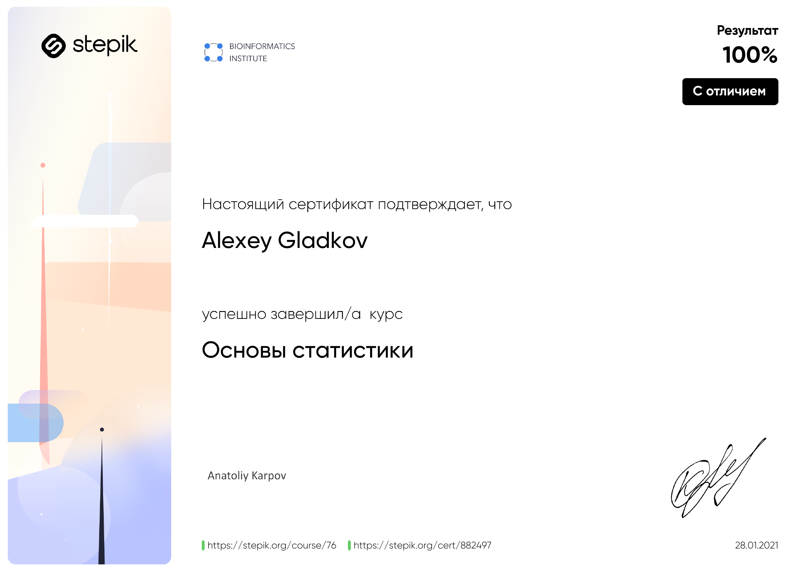
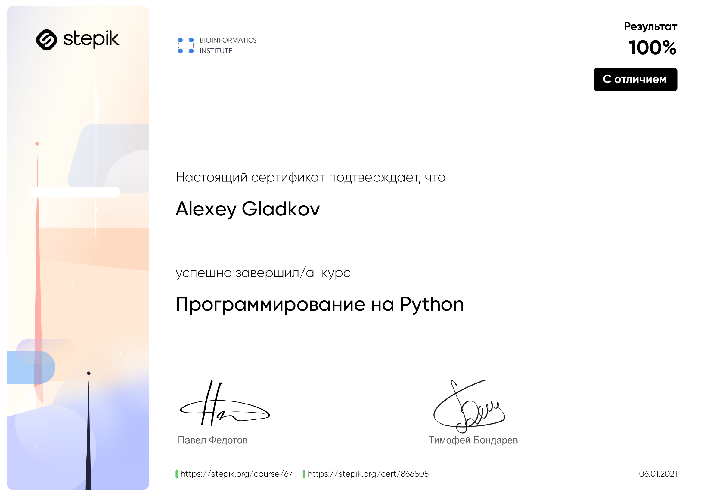
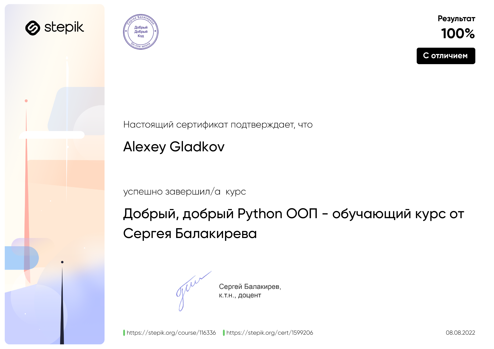
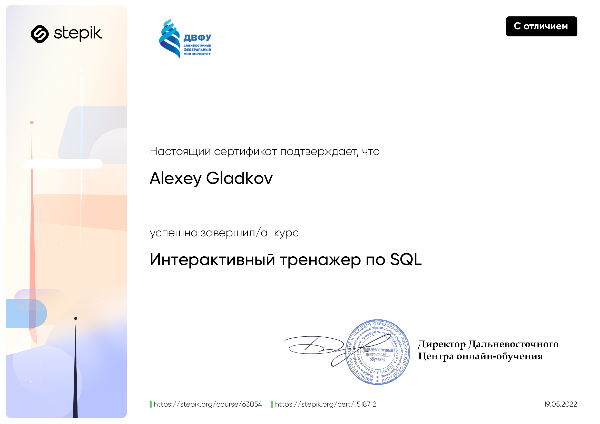
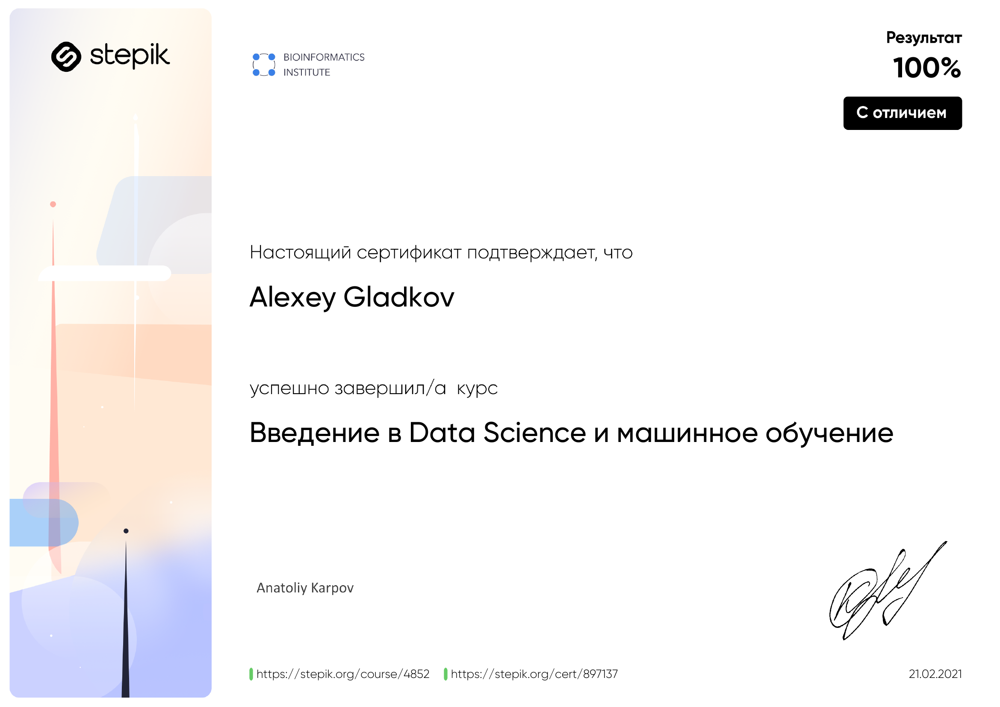
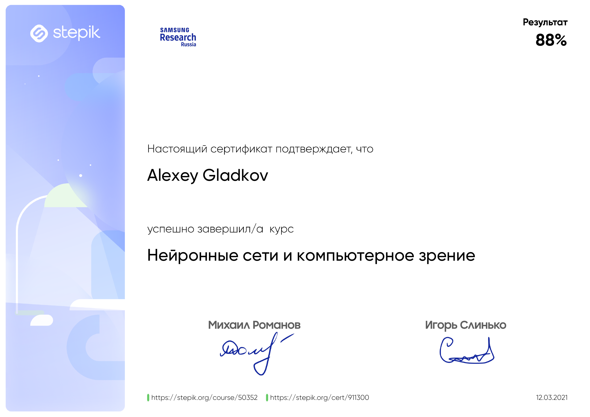

### Hi there 👋

Hi, i am Alexey. I study Python more than 2 years and used many libraries for web scraping and data analysis. 
I study in    
I don't have real experience at work but i learn quickly! 
I am looking for a place where i can get experience in real projects. 

<!--   -->

<h2 > 🚀 &nbsp;Some Tools I Have Used and Learned</h2>

<h2 > 🚀 &nbsp;My social media</h2>

 

 

<h2 > 🚀 &nbsp;Sertificates</h2>

<table>
<tr>
<td align="center"></td>
</tr>
<tr>
<td align="center"></td>
<td align="center"></td>
</tr>
<tr>
<td align="center"></td>
<td align="center"></td>
</tr>
<td align="center"></td>
<td align="center"></td>
</tr>
</table>

You can see my <a href="https://stepik.org/users/292380718">Stepik</a> account!

 

